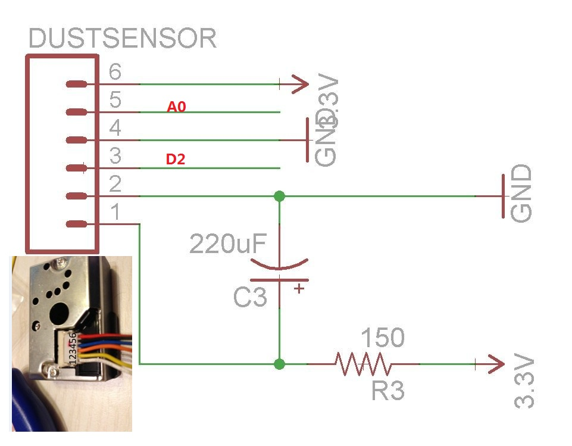
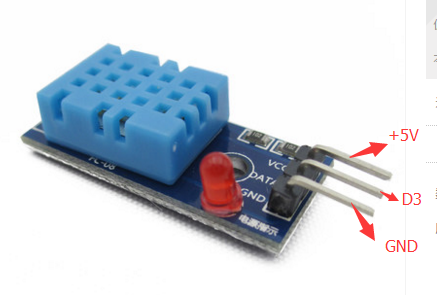

## 简介
`demo-c-airmonitor` 展示了如何利用野狗adk和arduino，温湿度/粉尘传感器快速构建一个实时空气采集系统，并在浏览器上把测温度、湿度、粉尘密度的实时值动态的显示出来，我们的目录结构如下：

	.
	├── docs
	├── html
	├── lib
	└── src

	`docs`:Arduino 和传感器的接线说明.
	`lib`:Arduino 库，安装在.\Arduino\libraries.
	`src`:Arduino 空气检测的arduino实现源码.
	`html`:html页面源码.

## 使用步骤
	
###第一步 硬件sensor连接
根据下图把DHT11和GP2Y1010 连接到arduino上。

###第二步 wilddog-client-arduino库安装
	

	1. 安装野狗sdk,下载[wilddog-client-arduino](https://github.com/WildDogTeam/wilddog-client-arduino)，并根据其说明进行安装。
	2. 安装DHT11库，把`/demo-c-airmonitor/lib/DHT11` 拷贝到arduino库目录下\Arduino\libraries\。

###第三步 修改demo源码并编译烧录到arduino中
打开`demo-c-pm25.ino`，把`yourAppId`改成你的AppId，并编译烧录到arduino中：

	#define YOURURL  "coap://yourAppId.wilddogio.com/"

###第四步 在浏览上实时显示温度、湿度、空气粉尘密度值
用浏览器打开html目录下的`index.html`，并在页面的show左方的输入框中输入你的AppId，点击`show`，你的arduino实时采集的温度、湿度、粉尘密度值会实时显示在页面上。
